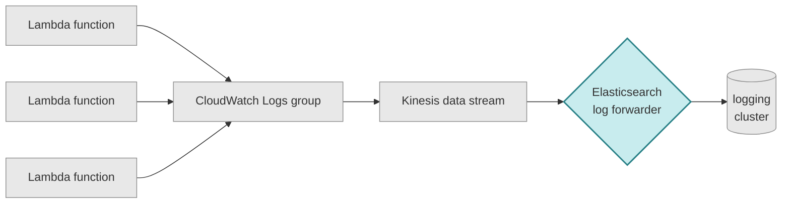

# elasticsearch-log-forwarder

A Lambda to forward logs from a Kinesis stream to our Elasticsearch logging cluster.

All our Lambda functions send their logs to a shared log group in CloudWatch.
These logs are forwarded to a Kinesis data stream, and then this Lambda forwads to logs to our shared logging cluster.

## Configuration

The Lambda expects 3 environment variables:

- `ELASTICSEARCH_HOST_SECRET`: ARN of a secret containing the host of the ES cluster (port 9243 and scheme HTTPS are currently hardcoded).
- `ELASTICSEARCH_API_KEY_SECRET`: ARN of a secret containing an API key for the application to use.
- `DATA_STREAM_NAME`: Name of the data stream in Elasticsearch to which logs will be written.

The Kinesis trigger is configured in Terraform using remote state from the shared platform-infrastructure stack: https://github.com/wellcomecollection/platform-infrastructure/tree/main/critical.

## Deployment

Deployment can be triggered in CI by unblocking a pipeline after tests and linting.

## Context

https://github.com/elastic/elastic-serverless-forwarder exists as a much more general version of this application. While it has the advantage of being maintained by Elastic, it doesn't currently support private VPCs and the format of the log documents it writes leaves much to be desired - as the functionality we need is so simple, it was straightforward to write our own, more configurable, application.
